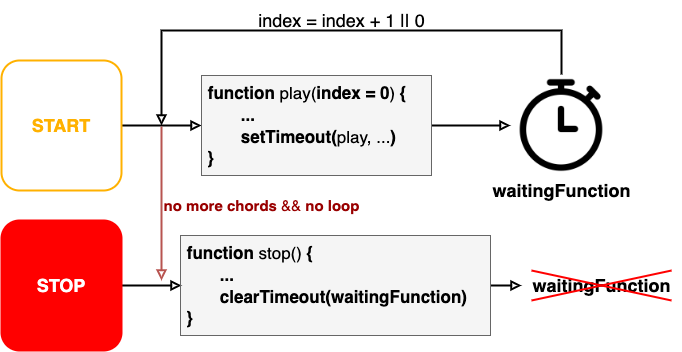

# **Voicings Generator**
<!--  -->

  

## Introduction
In music, in particular jazz, voicing is the vertical displacement of the notes in a chord. The goal of this web application is to propose an easy way to generate the most common voicing types. The project was developed for the courses **Advanced Coding Tools and Methodologies** and **Computer Music Representations and Models**, part the Master degree in [Music and Acoustic Engineering](https://suono.polimi.it/), based in [Politecnico di Milano](https://www.polimi.it/).

### Tools
The tools that have been used to delevop the application are:
* [Node.js](https://nodejs.org/it/)
* [Tone.js](https://tonejs.github.io/)
* [React](https://reactjs.org/) 
* [react-piano](https://github.com/kevinsqi/react-piano)
* [VexFlow](https://www.vexflow.com/)

This web application can be used downloadind the github project and running it with VS Code live server

## User Interface
The web application is very easy to use and understand. At the beginning it is possible to choose the key signature and the modal scale, then, with a double click or a drag and drop, it is possible to insert the chords in the top cells. It is possible to change the key signature and the modal scale, also after the insert of the chords or even when the player is running.

## Guide

  

When the application is tuned on the first line is empty. With a drag and drop (or a click) the user can insert the chords in the list. The user can also change the key signature and the modal scale and decide to activate or not the loop or the legato.

  

Then clicking the START button it turns red, the music start playing and the note on the stave will be shown.

### Descriptions and Settings
On the bottom of the page, the user can read the description of the voicings type he is currently using, and also change it by clicking on the name or type selectors. If the user clicks on the knob or settings icons, the descriptions are replaced by settings which either control the volumes and bpm of the chords' playback, or the instruments' characteristics (effects, attack and release)

  

### Printing the Chords Sequence
Clicking on the printer icon it is possible to print the voicings with the musical stave

  

## Algorithm - Factory Pattern

In order to achieve a high flexibility in terms of adding new Voicings Types or removing existing ones, the Voicings Algorithm has been implemented following a simplified Factory Pattern, in which ChordSuper contains methods ussed by all the sub-classes.

  

## Audio Chain

The sampler of Tone.js, is connected in parallel with two effects, Reverb and Chorus, each connected to a Gain node that controls their gain. The sampler is also connected to another Gain node which is used to deliver the dry output. All three nodes are connected to another Gain node which controls the overall volume of the instrument.

  

## The Main Loop
Voicings Generator's core comes down to a single loop which starts when the user presses the start button and stops either when the chords sequence is finished (if the loop mode is off) or when the user clicks the stop button. This loop is not an actual while or for loop, but rather a recursive function which continuously calls itself after a certain time has passed. This is achive using the function setTimeout()

  

# Voicings Types
In the following sections a briefly description of each implemented implemented.

## Rootless
A smooth and popular type of chord voicings are called (Bill Evans style) Rootless Chord Voicings. As the name suggests, these chord voicings exclude the root note. Instead of the root (and sometimes the 5th), the chord tension is played. This gives a jazzy sound (because of the tensions) while also not being too crowded. In rootless voicings, the top note should be between middle C and the C an octave above middle C on the keyboard, furthermore, the chord is entirely play by the left hand. 
There are also two ‘types’ of rootless chord voicings, in particular the first is the inversion of the second. These voicing works really well for II-V-I progressions, because you only need to change a few notes (and by only a small interval) to move from one chord to the next.

## Monk
Thelonious Monk is a Bebop Pianist known for his dissonant, quirky and asymmetrical style, rhythm and harmony. So, as could be expected, Thelonious Monk Chord Voicings have a bit of ‘bite’ (read dissonance). They have a semitone interval at the bottom of the chord and a 3rd on top. And because there are only two semitones in a diatonic scale (both Major and melodic minor), then there are only two possible chord shapes – one for the tonic chord and one for every other chord in that key.

## Powell
In Jazz, it’s possible to omit the less important notes (root \& 5th) to create a Shell Chord. Bud Powell Chord Voicings are also Shell Chords (they contain only two or three notes), but they always include the root (establishing the tonality of the chord). To facilitate this (and still keep it a Shell Chord) it is dropped either the 3rd or the 7th. Also these voicings are played by the left hand.

## Three Notes
The basic Shell Chord consists of only the 3rd and 7th (Guide Tones) of the chord. The Guide Tones are the two notes that determine the quality of the chord (Maj, min, V7, etc). These two notes are the bare minimum to play a chord.
An important part of being a competent jazz pianists is being able to voice chords with two hands. Three Note Voicings are a good way of beginning to do this. The structure is very simple, in order to play a Three Notes Voicing it is necessary to play the Shell Chord with the right hand and the root with the left hand.

## Four Notes
Another good way to start playing voicings with both hands are Four Note Voicings. Taking the basic Shell Chord, adding a note, usually the 5th, and playing it with right hand and then add a root note in left hand, we have a ‘Four Note Voicing’.

## Open Chord
To play in ‘close harmony’ means to play all the notes of the chord within the range of a single octave. While to play in ‘open harmony’ means to play all the same notes but over a span larger than an octave. This spreads the chord out over a wider range and in this way creates a richer, more balanced and more ‘open’ sound. This is called Voicing Tension.

# Folder Structure
    src
    ├── components
    │   ├── chordstable
    │   │   ├── ChordModeCell.js
    │   │   ├── ChordModeRow.js
    │   │   ├── ChordPlayCell.js
    │   │   ├── ChordPlayRow.js
    │   │   ├── ChordProgressionCell.js
    │   │   ├── ChordProgressionRow.js
    │   │   ├── ChordRootCell.js
    │   │   ├── ChordRootRow.js
    │   │   ├── ChordsTable.css
    │   │   └── ChordsTable.js
    │   ├── chordsvisualizer
    │   │   ├── ChordsScore.js
    │   │   ├── ChordsVisualizer.css
    │   │   ├── ChordsVisualizer.js
    │   │   └── LoadingaBar.js
    │   ├── settings
    │   │   ├── CheckButton.js
    │   │   ├── GlobalSettings.css
    │   │   ├── GlobalSettings.js
    │   │   ├── Knob.css
    │   │   ├── Knob.js
    │   │   ├── KnobHandler.js
    │   │   ├── MidiButton.js
    │   │   ├── OctaveSelector.js
    │   │   ├── PrinterButton.js
    │   │   ├── SettingsButton.js
    │   │   ├── SimpleInputSettings.js
    │   │   ├── StartButton.js
    │   │   └── VolumeControls.js
    │   ├── voicingsselector
    │   │   ├── Selector.js
    │   │   ├── VoicingsSelector.css
    │   │   ├── VoicingsSelector.js
    │   │   └── VoicingsSelectorDescriptions.js
    │   ├── scripts
    │   │   ├── Chords
    │   │   │   ├── ChordsFactory.js
    │   │   │   ├── ChordSuper.js
    │   │   │   ├── FourNoteChord.js
    │   │   │   ├── MonkChord.js
    │   │   │   ├── OpenChord.js
    │   │   │   ├── PowellChord.js
    │   │   │   ├── RootlessChord.js
    │   │   │   └── ThreeNoteChord.js
    │   │   ├── ChordAudioHandler.js
    │   │   ├── ChordProgressionHandler.js
    │   │   ├── GlobalVariables.js
    │   │   ├── Instruments.js
    │   │   ├── MidiHandler.js
    │   │   └── Tonalities.js
    │   ├── App.css
    │   ├── App.js
    │   ├── index.css
    │   └── index.js
    └──
    
    
# Group members
* Piferi Francesco - francesco.piferi@mail.polimi.it
* Rossi Riccardo - ricardo18.rossi@mail.polimi.it
* Terminiello Fredinando - ferdinando.terminiello@mail.polimi.it

# REPORT AND PRESENTATION
More details are in the report (LINKARE REPORT)
