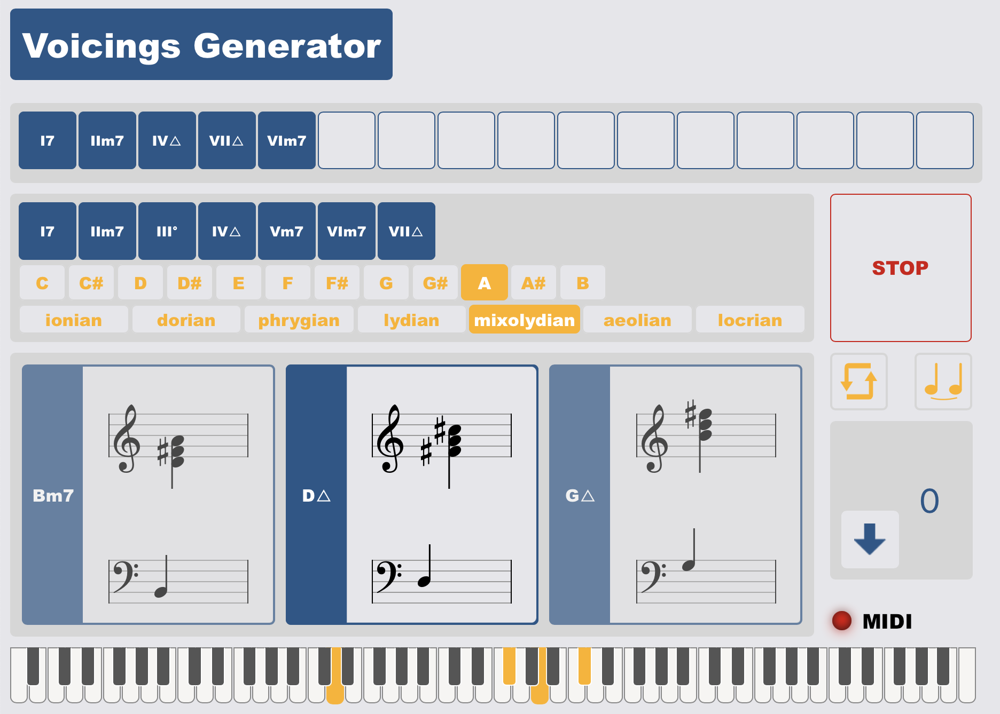
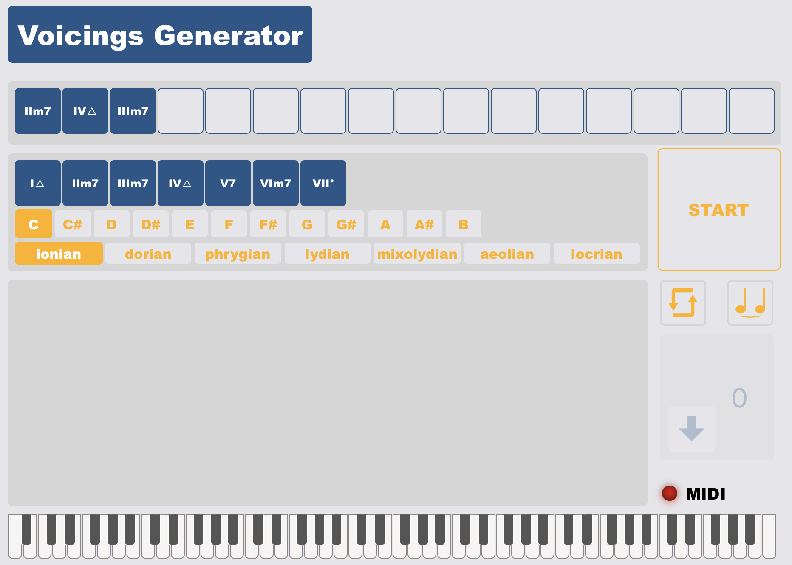

# **Voicings Generator**
<!--  -->

  

## Introduction
In music, in particular jazz, voicing is the vertical displacement of the notes in a chord. The goal of this web application is to propose an easy way to generate the most common voicing types. The project was developed for the courses **Advanced Coding Tools and Methodologies** and **Computer Music Representations and Models**, part the Master degree in [Music and Acoustic Engineering](https://suono.polimi.it/), based in [Politecnico di Milano](https://www.polimi.it/). 

### Tools
The tools that have been used to delevop the application are:
* [Node.js](https://nodejs.org/it/)
* [Tone.js](https://tonejs.github.io/)
* [React](https://reactjs.org/) 
* [react-piano](https://github.com/kevinsqi/react-piano)
* [VexFlow](https://www.vexflow.com/)

This web application can be used downloadind the github project and running it with VS Code live server

## User Interface
The web application is very easy to use and understand. At the beginning it is possible to choose the key signature and the modal scale, then, with a double click or a drag and drop, it is possible to insert the chords in the top cells. It is possible to change the key signature and the modal scale, also after the insert of the chords or even when the player is running.

## Guide
<!--  -->

  

When the application is tuned on the first line is empty. With a drag and drop (or a click) the user can insert the chords in the list. The user can also change the key signature and the modal scale.

  

Then clicking the START button it turns red, the music start playing and the note on the stave will be shown.

### Desctiptions
On the bottom of the page, the user read the descriptions of the voicing he is currently using, and also change it clicking on the name, or type, of it

  

### Effect
Clicking on the knob icon, the description will be replaced by the following knobs which control the effects, both for the chords played by the application and for the midi, if plugged in.

  

### Settings
Clicking on the gear icon, the user can control the volume and the bpm of the application.

  

### Print
Clicking on the printer icon it is possible to print the voicings with the musical stave

  

## Folder Structure
    src
    ├── components
    │   ├── chordstable
    │   │   ├── ChordModeCell.js
    │   │   ├── ChordModeRow.js
    │   │   ├── ChordPlayCell.js
    │   │   ├── ChordPlayRow.js
    │   │   ├── ChordProgressionCell.js
    │   │   ├── ChordProgressionRow.js
    │   │   ├── ChordRootCell.js
    │   │   ├── ChordRootRow.js
    │   │   ├── ChordsTable.css
    │   │   └── ChordsTable.js
    │   ├── chordsvisualizer
    │   │   ├── ChordsScore.js
    │   │   ├── ChordsVisualizer.css
    │   │   ├── ChordsVisualizer.js
    │   │   └── LoadingaBar.js
    │   ├── settings
    │   │   ├── CheckButton.js
    │   │   ├── GlobalSettings.css
    │   │   ├── GlobalSettings.js
    │   │   ├── Knob.css
    │   │   ├── Knob.js
    │   │   ├── KnobHandler.js
    │   │   ├── MidiButton.js
    │   │   ├── SettingsButton.js
    │   │   ├── SimpleInputSettings.js
    │   │   └── StartButton.js
    │   ├── voicingsselector
    │   │   ├── Selector.js
    │   │   ├── VoicingsSelector.css
    │   │   ├── VoicingsSelector.js
    │   │   └── VoicingsSelectorDescriptions.js
    │   ├── resources
    │   │   ├── Knob.png
    │   │   └── KnobIndicator.png
    │   ├── scripts
    │   │   ├── Chord.js
    │   │   ├── ChordAudioHandler.js
    │   │   ├── ChordProgressionHandler.js
    │   │   ├── GlobalVariables.js
    │   │   ├── Instruments.js
    │   │   ├── Tonalities.js
    │   │   ├── VoicingsFunctions.js
    │   │   └── VoicingsHandler.js
    │   ├── App.css
    │   ├── App.js
    │   ├── index.css
    │   └── index.js
    └──

